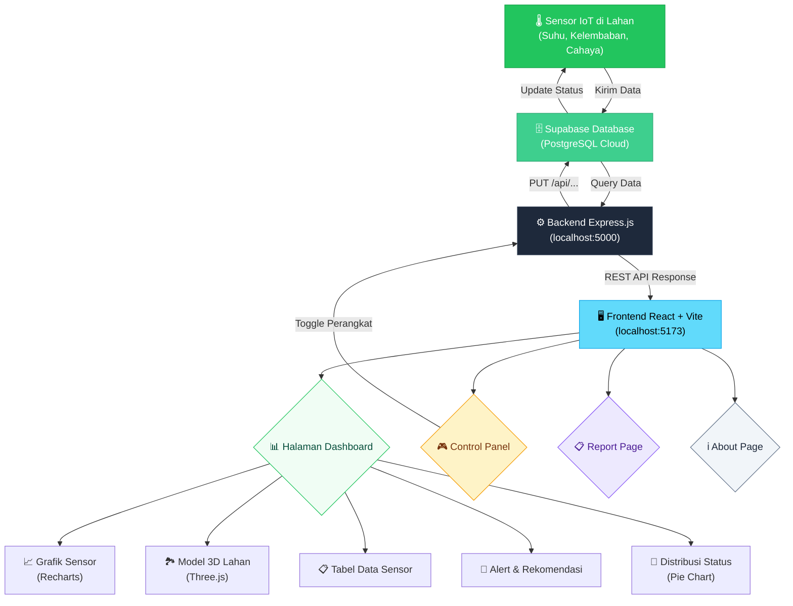
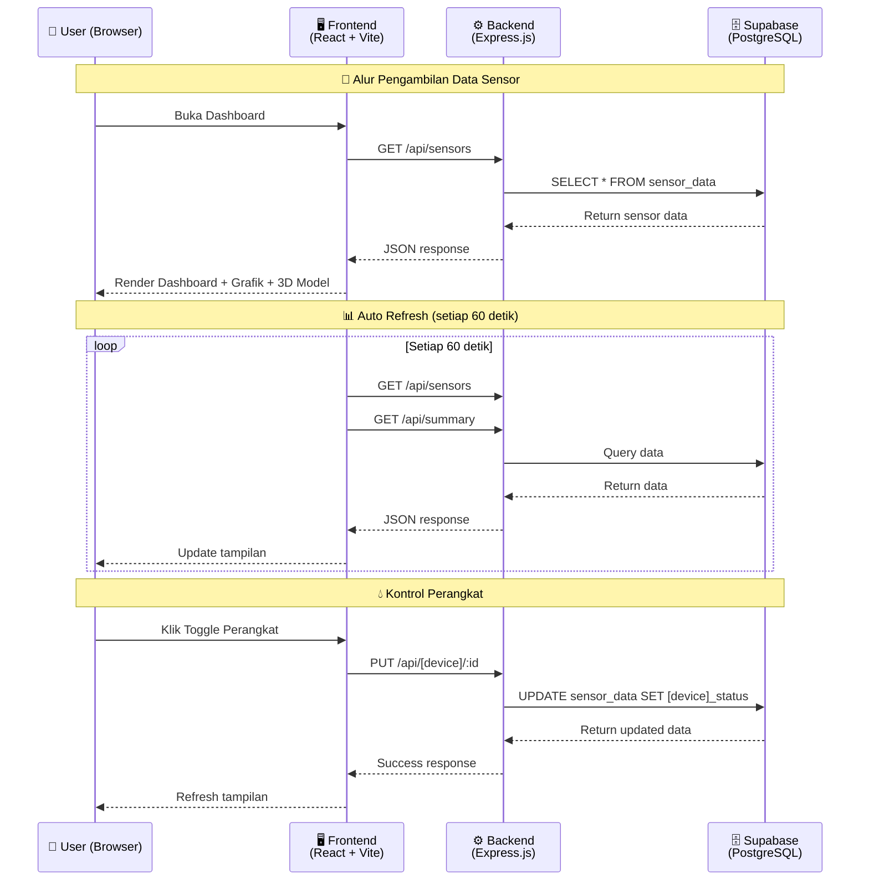

# 🌾 Smart Farming IoT Monitoring System

<div align="center">

**Sistem monitoring lahan pertanian berbasis IoT dengan visualisasi data real-time, model 3D interaktif, dan kontrol aktuator otomatis.**

[](https://react.dev/)
[](https://vite.dev/)
[](https://expressjs.com/)
[](https://supabase.com/)
[](https://threejs.org/)

</div>

---

## 📖 Tentang Proyek

**Smart Farming IoT Monitoring System** adalah aplikasi web full-stack yang dirancang untuk memantau kondisi lahan pertanian secara real-time. Sistem ini mensimulasikan penggunaan sensor IoT pada beberapa petak lahan pertanian, di mana data sensor (suhu, kelembaban tanah, kelembaban udara, intensitas cahaya) dan status perangkat (pompa, kipas, lampu, mode kontrol) disimpan di **Supabase** (cloud database), diproses melalui **backend Express.js**, dan divisualisasikan di **frontend React + Vite** dengan tampilan dashboard interaktif dan model 3D.

### 🎯 Tujuan Proyek

- Memonitor kondisi lahan pertanian secara real-time melalui dashboard berbasis web
- Menyediakan visualisasi data sensor dalam bentuk grafik, tabel, dan model 3D interaktif
- Memberikan rekomendasi otomatis berdasarkan kondisi sensor (decision support)
- Mengendalikan aktuator (pompa irigasi, kipas ventilasi, lampu tanaman) secara remote dan otomatis
- Menghasilkan laporan kondisi lahan untuk keperluan analisis

---

## 🛠️ Tech Stack

### Frontend
| Teknologi | Versi | Fungsi |
|-----------|-------|--------|
| **React** | 19.2 | Library UI untuk membangun antarmuka pengguna |
| **Vite** | 8.0 | Build tool & dev server yang cepat |
| **React Router DOM** | 7.15 | Navigasi antar halaman (SPA routing) |
| **Recharts** | 3.8 | Visualisasi data dalam bentuk grafik (Line, Bar, Pie) |
| **Three.js** | 0.184 | Rendering model 3D interaktif lahan pertanian |
| **Axios** | 1.16 | HTTP client untuk komunikasi dengan backend API |
| **Lucide React** | 1.16 | Ikon modern untuk antarmuka |
| **CSS** | - | Styling kustom (tanpa framework CSS) |

### Backend
| Teknologi | Versi | Fungsi |
|-----------|-------|--------|
| **Node.js** | - | Runtime JavaScript di sisi server |
| **Express.js** | 5.2 | Framework web untuk membuat REST API |
| **Supabase JS** | 2.106 | Client SDK untuk mengakses database Supabase |
| **dotenv** | 17.4 | Mengelola environment variables |
| **CORS** | 2.8 | Middleware untuk mengizinkan cross-origin requests |
| **Nodemon** | 3.1 | Auto-restart server saat development |

### Database
| Teknologi | Fungsi |
|-----------|--------|
| **Supabase (PostgreSQL)** | Cloud database untuk menyimpan data sensor IoT |

---

## 🔄 Alur Kerja Sistem (Flowchart)



### Alur Detail



---

## 📂 Struktur Folder

```
monitoring_smartfarming/
│
├── 📁 backend/                    # Server-side application
│   ├── 📄 server.js               # Entry point Express server & API routes
│   ├── 📄 supabaseClient.js       # Konfigurasi koneksi Supabase
│   ├── 📄 package.json            # Dependencies backend
│   └── 📄 .env                    # Environment variables (SUPABASE_URL, SUPABASE_KEY)
│
├── 📁 frontend/                   # Client-side application
│   ├── 📁 src/
│   │   ├── 📁 components/
│   │   │   ├── 📄 Farm3DModel.jsx     # Model 3D interaktif lahan (Three.js)
│   │   │   ├── 📄 Navbar.jsx          # Komponen navigasi
│   │   │   ├── 📄 SensorTable.jsx     # Tabel data sensor
│   │   │   └── 📄 SystemPreview.jsx   # Preview arsitektur sistem
│   │   │
│   │   ├── 📁 pages/
│   │   │   ├── 📄 HomePage.jsx        # Halaman utama / landing page
│   │   │   ├── 📄 DashboardPage.jsx   # Dashboard monitoring utama
│   │   │   ├── 📄 ControlPanelPage.jsx# Kontrol pompa irigasi
│   │   │   ├── 📄 ReportPage.jsx      # Laporan kondisi lahan
│   │   │   └── 📄 AboutPage.jsx       # Informasi tentang proyek
│   │   │
│   │   ├── 📁 utils/
│   │   │   └── 📄 farmUtils.js        # Helper functions (status, rekomendasi)
│   │   │
│   │   ├── 📄 App.jsx                 # Root component & routing
│   │   ├── 📄 App.css                 # Styling utama aplikasi
│   │   └── 📄 index.css               # Base CSS & reset
│   │
│   ├── 📄 package.json            # Dependencies frontend
│   └── 📄 vite.config.js          # Konfigurasi Vite
│
├── 📄 README.md                   # Dokumentasi proyek (file ini)
└── 📄 .gitignore                  # File yang diabaikan git
```

---

## 🚀 Cara Instalasi & Menjalankan

### Prasyarat

Pastikan sudah terinstal di komputer kamu:

- **[Node.js](https://nodejs.org/)** versi 18 atau lebih baru
- **npm** (sudah termasuk saat install Node.js)
- Akun **[Supabase](https://supabase.com/)** dengan tabel `sensor_data`

### Langkah 1 — Clone Repository

```bash
git clone https://github.com/alfarezalfathir/MonitoringSmartFarming.git
cd MonitoringSmartFarming
```

### Langkah 2 — Setup Database Supabase

1. Buat project baru di [Supabase](https://supabase.com/)
2. Buat tabel `sensor_data` dengan kolom berikut:

| Kolom | Tipe | Keterangan |
|-------|------|------------|
| `id` | int8 (Primary Key) | ID unik sensor |
| `area` | text | Nama petak lahan (contoh: "Petak 1") |
| `temperature` | float8 | Suhu dalam °C |
| `soil_moisture` | float8 | Kelembaban tanah dalam % |
| `humidity` | float8 | Kelembaban udara dalam % |
| `light` | float8 | Intensitas cahaya dalam lux |
| `pump_status` | text | Status pompa ("ON" / "OFF") |
| `fan_status` | text | Status kipas ("ON" / "OFF") |
| `lamp_status` | text | Status lampu ("ON" / "OFF") |
| `control_mode` | text | Mode kontrol ("MANUAL" / "AUTO") |

3. Isi dengan data dummy (contoh 8 petak lahan)

### Langkah 3 — Setup Backend

```bash
# Masuk ke folder backend
cd backend

# Install dependencies
npm install

# Buat file .env (sesuaikan dengan credentials Supabase kamu)
```

Buat file `.env` di folder `backend/` dengan isi:

```env
SUPABASE_URL=https://your-project-id.supabase.co
SUPABASE_KEY=your-anon-key
PORT=5000
```

> ⚠️ **Penting:** Ganti `SUPABASE_URL` dan `SUPABASE_KEY` dengan credentials dari dashboard Supabase kamu (Settings → API).

```bash
# Jalankan backend (development mode)
npm run dev
```

Backend akan berjalan di: **http://localhost:5000**

### Langkah 4 — Setup Frontend

```bash
# Buka terminal baru, masuk ke folder frontend
cd frontend

# Install dependencies
npm install

# Jalankan frontend (development mode)
npm run dev
```

Frontend akan berjalan di: **http://localhost:5173**

### Langkah 5 — Buka Aplikasi

Buka browser dan akses: **http://localhost:5173**

> 💡 **Tips:** Pastikan backend (port 5000) sudah berjalan terlebih dahulu sebelum membuka frontend agar data sensor bisa tampil.

---

## 🌐 API Endpoints

| Method | Endpoint | Deskripsi |
|--------|----------|-----------|
| `GET` | `/` | Cek status server |
| `GET` | `/api/sensors` | Ambil semua data sensor |
| `GET` | `/api/summary` | Ambil ringkasan dashboard (total petak, rata-rata, dll) |
| `PUT` | `/api/pump/:id` | Update status pompa (ON/OFF) berdasarkan ID sensor |
| `PUT` | `/api/fan/:id` | Update status kipas (ON/OFF) berdasarkan ID sensor |
| `PUT` | `/api/lamp/:id` | Update status lampu (ON/OFF) berdasarkan ID sensor |
| `PUT` | `/api/control-mode/:id` | Ubah mode kontrol perangkat (AUTO/MANUAL) |
| `POST` | `/api/auto-control` | Menjalankan ulang logika kontrol otomatis |

### Contoh Response `/api/sensors`

```json
[
  {
    "id": 1,
    "area": "Petak 1",
    "temperature": 31,
    "soil_moisture": 18,
    "humidity": 64,
    "light": 820,
    "pump_status": "ON",
    "fan_status": "OFF",
    "lamp_status": "OFF",
    "control_mode": "MANUAL"
  }
]
```

### Contoh Response `/api/summary`

```json
{
  "totalPetak": 8,
  "avgSoilMoisture": "45.6",
  "maxTemperature": 34,
  "activePump": 5,
  "activeFan": 2,
  "activeLamp": 1,
  "autoModeArea": 4,
  "criticalArea": 4
}
```

---

## 📊 Fitur Utama

### 🏠 Home Page
- Landing page dengan penjelasan sistem
- Preview arsitektur teknologi yang digunakan

### 📈 Dashboard
- **Summary Cards** — Total petak, rata-rata kelembaban, suhu tertinggi, perangkat aktif, area kritis
- **Model 3D Interaktif** — Visualisasi lahan pertanian dengan Three.js (drag, zoom, klik petak)
- **Alert Kondisi Lahan** — Peringatan untuk area yang membutuhkan perhatian
- **Distribusi Status** — Pie chart status Normal / Waspada / Kritis
- **Rekomendasi Sistem** — Decision support otomatis berdasarkan data sensor
- **Grafik Kelembaban & Suhu** — Line chart dan bar chart per petak
- **Tabel Data Sensor** — Data lengkap dari Supabase dengan live badge
- **Auto Refresh** — Data diperbarui otomatis setiap 60 detik

### 🎮 Control Panel
- Kontrol aktuator (pompa irigasi, kipas ventilasi, lampu tanaman)
- Toggle ON/OFF perangkat secara individual
- Pengaturan mode AUTO / MANUAL untuk setiap petak

### 📋 Report
- Laporan ringkasan kondisi seluruh petak lahan
- Statistik dan analisis data sensor

### ℹ️ About
- Informasi tentang proyek dan teknologi yang digunakan

---

## ⚙️ Logika Status Sensor

Sistem menentukan status lahan berdasarkan dua parameter utama:

| Status | Kondisi | Warna |
|--------|---------|-------|
| 🟢 **Normal** | Kelembaban tanah ≥ 40% **DAN** Suhu ≤ 31°C | Hijau |
| 🟡 **Waspada** | Kelembaban tanah 25–39% **ATAU** Suhu 31–33°C | Kuning |
| 🔴 **Kritis** | Kelembaban tanah < 25% **ATAU** Suhu > 33°C | Merah |

---

## 👨‍💻 Dibuat Oleh

**Alfareza Alfathir**

---

## 📄 Lisensi

Proyek ini dibuat untuk keperluan edukasi dan pengembangan.
