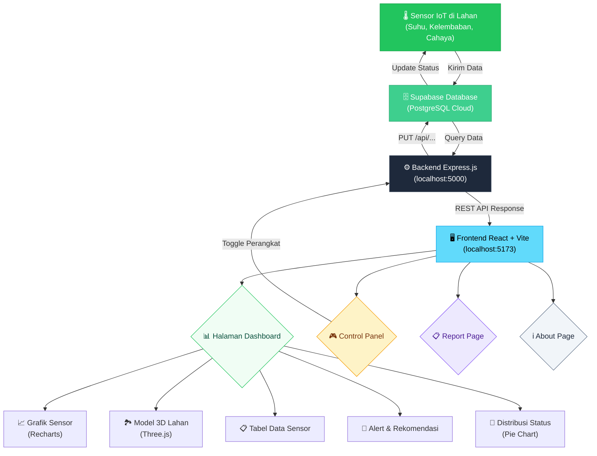
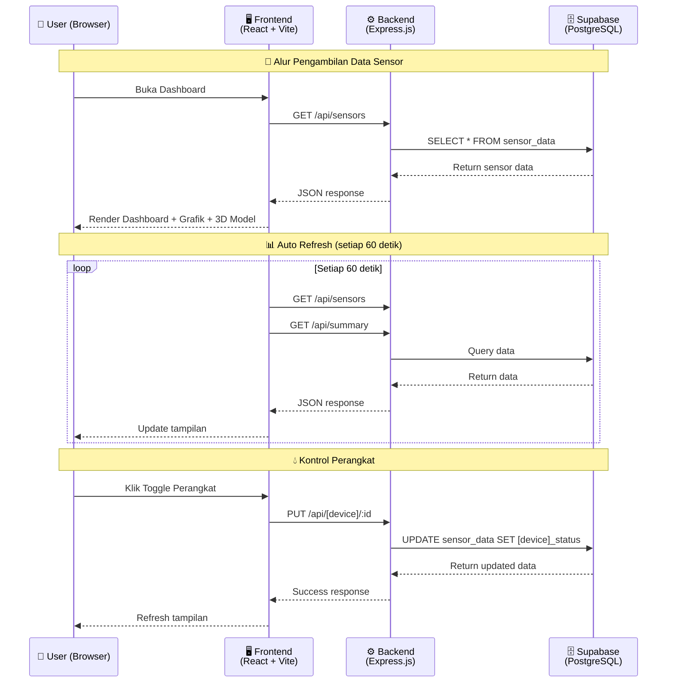

# 🌾 Smart Farming IoT Monitoring System

<div align="center">

**Sistem monitoring lahan pertanian berbasis IoT dengan visualisasi data real-time, model 3D interaktif, dan kontrol aktuator otomatis.**

[](https://react.dev/)
[](https://vite.dev/)
[](https://expressjs.com/)
[](https://supabase.com/)
[](https://threejs.org/)

</div>

---

## 📖 Tentang Proyek

**Smart Farming IoT Monitoring System** adalah aplikasi web full-stack yang dirancang untuk memantau kondisi lahan pertanian secara near real-time. Sistem ini mensimulasikan penggunaan sensor IoT pada beberapa petak lahan pertanian, di mana data sensor (suhu, kelembaban tanah, kelembaban udara, intensitas cahaya) dan status perangkat (pompa, kipas, lampu, mode kontrol) disimpan di **Supabase** (cloud database), diproses melalui **backend Express.js**, dan divisualisasikan di **frontend React + Vite** dengan tampilan dashboard interaktif dan model 3D.

### 🎯 Tujuan Proyek

- Memonitor kondisi lahan pertanian secara real-time melalui dashboard berbasis web
- Menyediakan visualisasi data sensor dalam bentuk grafik, tabel, dan model 3D interaktif
- Memberikan rekomendasi otomatis berdasarkan kondisi sensor (decision support)
- Mengendalikan aktuator (pompa irigasi, kipas ventilasi, lampu tanaman) secara remote dan otomatis
- Menghasilkan laporan kondisi lahan untuk keperluan analisis

---

## 🛠️ Tech Stack

### Frontend
| Teknologi | Versi | Fungsi |
|-----------|-------|--------|
| **React** | 19.2 | Library UI untuk membangun antarmuka pengguna |
| **Vite** | 8.0 | Build tool & dev server yang cepat |
| **React Router DOM** | 7.15 | Navigasi antar halaman (SPA routing) |
| **Recharts** | 3.8 | Visualisasi data dalam bentuk grafik (Line, Bar, Pie) |
| **Three.js** | 0.184 | Rendering model 3D interaktif lahan pertanian |
| **Axios** | 1.16 | HTTP client untuk komunikasi dengan backend API |
| **Lucide React** | 1.16 | Ikon modern untuk antarmuka |
| **CSS** | - | Styling kustom (tanpa framework CSS) |

### Backend
| Teknologi | Versi | Fungsi |
|-----------|-------|--------|
| **Node.js** | - | Runtime JavaScript di sisi server |
| **Express.js** | 5.2 | Framework web untuk membuat REST API |
| **Supabase JS** | 2.106 | Client SDK untuk mengakses database Supabase |
| **dotenv** | 17.4 | Mengelola environment variables |
| **CORS** | 2.8 | Middleware untuk mengizinkan cross-origin requests |
| **Nodemon** | 3.1 | Auto-restart server saat development |

### Database
| Teknologi | Fungsi |
|-----------|--------|
| **Supabase (PostgreSQL)** | Cloud database untuk menyimpan data sensor IoT |

---

## 🔄 Alur Kerja Sistem (Flowchart)



### Alur Detail



---

## 📂 Struktur Folder

```
monitoring_smartfarming/
│
├── 📁 backend/                    # Server-side application
│   ├── 📁 scripts/                # Script pengujian teknis
│   │   ├── 📄 testLatency.js      # Pengujian latensi penyimpanan data sensor
│   │   └── 📁 results/            # File CSV dan ringkasan hasil pengujian
│   ├── 📄 server.js               # Entry point Express server & API routes
│   ├── 📄 supabaseClient.js       # Konfigurasi koneksi Supabase
│   ├── 📄 package.json            # Dependencies backend
│   └── 📄 .env                    # Environment variables (SUPABASE_URL, SUPABASE_KEY)
│
├── 📁 frontend/                   # Client-side application
│   ├── 📁 src/
│   │   ├── 📁 components/
│   │   │   ├── 📄 Farm3DModel.jsx     # Model 3D interaktif lahan (Three.js)
│   │   │   ├── 📄 Navbar.jsx          # Komponen navigasi
│   │   │   ├── 📄 SensorTable.jsx     # Tabel data sensor
│   │   │   └── 📄 SystemPreview.jsx   # Preview arsitektur sistem
│   │   │
│   │   ├── 📁 pages/
│   │   │   ├── 📄 HomePage.jsx        # Halaman utama / landing page
│   │   │   ├── 📄 DashboardPage.jsx   # Dashboard monitoring utama
│   │   │   ├── 📄 ControlPanelPage.jsx# Kontrol pompa irigasi
│   │   │   ├── 📄 ReportPage.jsx      # Laporan kondisi lahan
│   │   │   └── 📄 AboutPage.jsx       # Informasi tentang proyek
│   │   │
│   │   ├── 📁 utils/
│   │   │   └── 📄 farmUtils.js        # Helper functions (status, rekomendasi)
│   │   │
│   │   ├── 📄 App.jsx                 # Root component & routing
│   │   ├── 📄 App.css                 # Styling utama aplikasi
│   │   └── 📄 index.css               # Base CSS & reset
│   │
│   ├── 📄 package.json            # Dependencies frontend
│   └── 📄 vite.config.js          # Konfigurasi Vite
│
├── 📄 README.md                   # Dokumentasi proyek (file ini)
└── 📄 .gitignore                  # File yang diabaikan git
```

---

## 🚀 Cara Instalasi & Menjalankan

### Prasyarat

Pastikan sudah terinstal di komputer kamu:

- **[Node.js](https://nodejs.org/)** versi 18 atau lebih baru
- **npm** (sudah termasuk saat install Node.js)
- Akun **[Supabase](https://supabase.com/)** dengan tabel `sensor_data`

### Langkah 1 — Clone Repository

```bash
git clone https://github.com/alfarezalfathir/MonitoringSmartFarming.git
cd MonitoringSmartFarming
```

### Langkah 2 — Setup Database Supabase

1. Buat project baru di [Supabase](https://supabase.com/)
2. Buat tabel `sensor_data` dengan kolom berikut:

| Kolom | Tipe | Keterangan |
|-------|------|------------|
| `id` | int8 (Primary Key) | ID unik sensor |
| `area` | text | Nama petak lahan (contoh: "Petak 1") |
| `temperature` | float8 | Suhu dalam °C |
| `soil_moisture` | float8 | Kelembaban tanah dalam % |
| `humidity` | float8 | Kelembaban udara dalam % |
| `light` | float8 | Intensitas cahaya dalam lux |
| `pump_status` | text | Status pompa ("ON" / "OFF") |
| `fan_status` | text | Status kipas ("ON" / "OFF") |
| `lamp_status` | text | Status lampu ("ON" / "OFF") |
| `control_mode` | text | Mode kontrol ("MANUAL" / "AUTO") |
| `acquisition_time` | timestamptz | Waktu data sensor dibaca atau dibuat |
| `storage_time` | timestamptz | Waktu data tersimpan di database |

3. Isi dengan data dummy (contoh 8 petak lahan)

### Langkah 3 — Setup Backend

```bash
# Masuk ke folder backend
cd backend

# Install dependencies
npm install

# Buat file .env (sesuaikan dengan credentials Supabase kamu)
```

Buat file `.env` di folder `backend/` dengan isi:

```env
SUPABASE_URL=https://your-project-id.supabase.co
SUPABASE_KEY=your-anon-key
PORT=5000
```

> ⚠️ **Penting:** Ganti `SUPABASE_URL` dan `SUPABASE_KEY` dengan credentials dari dashboard Supabase kamu (Settings → API).

```bash
# Jalankan backend (development mode)
npm run dev
```

Backend akan berjalan di: **http://localhost:5000**

### Langkah 4 — Setup Frontend

```bash
# Buka terminal baru, masuk ke folder frontend
cd frontend

# Install dependencies
npm install

# Jalankan frontend (development mode)
npm run dev
```

Frontend akan berjalan di: **http://localhost:5173**

### Langkah 5 — Buka Aplikasi

Buka browser dan akses: **http://localhost:5173**

> 💡 **Tips:** Pastikan backend (port 5000) sudah berjalan terlebih dahulu sebelum membuka frontend agar data sensor bisa tampil.

---

## 🌐 API Endpoints

| Method | Endpoint | Deskripsi |
|--------|----------|-----------|
| `GET` | `/` | Cek status server |
| `GET` | `/api/sensors` | Ambil semua data sensor |
| `GET` | `/api/summary` | Ambil ringkasan dashboard (total petak, rata-rata, dll) |
| `PUT` | `/api/pump/:id` | Update status pompa (ON/OFF) berdasarkan ID sensor |
| `PUT` | `/api/fan/:id` | Update status kipas (ON/OFF) berdasarkan ID sensor |
| `PUT` | `/api/lamp/:id` | Update status lampu (ON/OFF) berdasarkan ID sensor |
| `PUT` | `/api/control-mode/:id` | Ubah mode kontrol perangkat (AUTO/MANUAL) |
| `POST` | `/api/auto-control` | Menjalankan ulang logika kontrol otomatis |

### Contoh Response `/api/sensors`

```json
[
  {
    "id": 1,
    "area": "Petak 1",
    "temperature": 31,
    "soil_moisture": 18,
    "humidity": 64,
    "light": 820,
    "pump_status": "ON",
    "fan_status": "OFF",
    "lamp_status": "OFF",
    "control_mode": "MANUAL"
  }
]
```

### Contoh Response `/api/summary`

```json
{
  "totalPetak": 8,
  "avgSoilMoisture": "45.6",
  "maxTemperature": 34,
  "activePump": 5,
  "activeFan": 2,
  "activeLamp": 1,
  "autoModeArea": 4,
  "criticalArea": 4
}
```

---

## 📊 Fitur Utama

### 🏠 Home Page
- Landing page dengan penjelasan sistem
- Preview arsitektur teknologi yang digunakan

### 📈 Dashboard
- **Summary Cards** — Total petak, rata-rata kelembaban, suhu tertinggi, perangkat aktif, area kritis
- **Model 3D Interaktif** — Visualisasi lahan pertanian dengan Three.js (drag, zoom, klik petak)
- **Alert Kondisi Lahan** — Peringatan untuk area yang membutuhkan perhatian
- **Distribusi Status** — Pie chart status Normal / Waspada / Kritis
- **Rekomendasi Sistem** — Decision support otomatis berdasarkan data sensor
- **Grafik Kelembaban & Suhu** — Line chart dan bar chart per petak
- **Tabel Data Sensor** — Data lengkap dari Supabase dengan live badge
- **Auto Refresh** — Data diperbarui otomatis setiap 60 detik

### 🎮 Control Panel
- Kontrol aktuator (pompa irigasi, kipas ventilasi, lampu tanaman)
- Toggle ON/OFF perangkat secara individual
- Pengaturan mode AUTO / MANUAL untuk setiap petak

### 📋 Report
- Laporan ringkasan kondisi seluruh petak lahan
- Statistik dan analisis data sensor
- Tabel detail kondisi sensor dan status aktuator
- Fitur cetak laporan dan download CSV

### ℹ️ About
- Informasi tentang proyek dan teknologi yang digunakan

---

## ⚙️ Logika Status Sensor

Sistem menentukan status lahan berdasarkan kelembaban tanah, suhu, dan intensitas cahaya:

| Status | Kondisi | Warna |
|--------|---------|-------|
| 🟢 **Normal** | Kelembaban tanah ≥ 40%, suhu ≤ 31°C, dan cahaya berada pada rentang normal | Hijau |
| 🟡 **Waspada** | Kelembaban tanah 25–39% **ATAU** suhu > 31°C **ATAU** cahaya > 850 lux | Kuning |
| 🔴 **Kritis** | Kelembaban tanah < 25% **ATAU** suhu > 33°C **ATAU** cahaya < 300 lux | Merah |

### 🤖 Logika Kontrol Otomatis

| Aktuator | Kondisi | Hasil |
|----------|---------|-------|
| Pompa irigasi | Kelembaban tanah < 25% | Pompa menyala otomatis |
| Kipas ventilasi | Suhu > 33°C | Kipas menyala otomatis |
| Lampu tanaman | Intensitas cahaya < 300 lux | Lampu menyala otomatis |

---

## 🧪 Pengujian Dashboard

Pengujian dilakukan untuk memastikan dashboard dapat menyimpan data sensor dengan cepat, berjalan dengan baik pada beberapa browser, dan mudah digunakan oleh calon pengguna. Tiga jenis pengujian yang digunakan adalah:

| No. | Pengujian | Jenis | Tujuan |
|-----|-----------|-------|--------|
| 1 | **System Usability Scale (SUS)** | Pengujian pengguna | Mengukur kemudahan penggunaan dan memperoleh masukan calon pengguna |
| 2 | **Latensi Penyimpanan Data Sensor** | Pengujian teknis | Mengukur waktu yang dibutuhkan sejak data sensor dibuat sampai tersimpan di Supabase |
| 3 | **Lighthouse dan Kompatibilitas Browser** | Pengujian teknis | Mengukur performa tampilan serta memastikan fitur berjalan pada beberapa browser |

### 1. System Usability Scale (SUS)

#### Konsep

SUS digunakan untuk mengetahui apakah dashboard mudah dipahami dan nyaman digunakan. Calon pengguna mencoba fitur utama terlebih dahulu, lalu mengisi 10 pertanyaan SUS menggunakan skala 1–5 serta memberikan saran perbaikan.

#### Langkah pengujian

1. Jalankan backend dan frontend.
2. Minta responden mencoba halaman **Dashboard**, **Control Panel**, **Report**, dan **About**.
3. Minta responden mencoba grafik, model 3D, kontrol pompa, kipas, lampu, serta mode AUTO dan MANUAL.
4. Sebarkan Google Form yang berisi 10 pertanyaan SUS dengan skala 1–5.
5. Tambahkan satu pertanyaan terbuka: *Apa saran atau masukan Anda untuk memperbaiki dashboard Smart Farming ini?*
6. Hitung skor SUS setiap responden:
   - Pertanyaan ganjil: `jawaban - 1`
   - Pertanyaan genap: `5 - jawaban`
   - Skor akhir: `total skor kontribusi × 2,5`
7. Hitung nilai rata-rata seluruh responden dan gunakan masukan mereka sebagai dasar perbaikan dashboard.

> Dashboard tidak wajib di-deploy apabila responden mencoba sistem secara langsung melalui laptop yang menjalankan localhost.

---

### 2. Pengujian Latensi Penyimpanan Data Sensor

#### Konsep

Pengujian ini mengukur selisih waktu antara saat data sensor dibuat atau dibaca (`acquisition_time`) dan saat data berhasil tersimpan di Supabase (`storage_time`).

```text
Latensi penyimpanan = storage_time - acquisition_time
```

Pengujian menggunakan data dummy yang dibuat otomatis oleh script Node.js untuk mensimulasikan pembacaan sensor. Fokus pengujian adalah mengukur kecepatan penyimpanan data ke database, bukan menguji akurasi sensor fisik.

#### Kenapa perlu membuat tabel baru?

Tabel `sensor_latency_test` dibuat khusus untuk menampung data pengujian agar ratusan data dummy tidak masuk ke tabel utama `sensor_data`. Dengan begitu, data dashboard 8 petak tetap aman dan tampilan dashboard tidak terganggu.

#### Rentang data dummy

| Sensor | Rentang |
|--------|---------|
| Suhu | 24–36°C |
| Kelembaban tanah | 15–70% |
| Kelembaban udara | 50–90% |
| Intensitas cahaya | 200–1000 lux |

#### Kode pembuatan data dummy

Kode berikut berada pada file:

```text
backend/scripts/testLatency.js
```

```js
function randomNumber(min, max) {
  return Number((Math.random() * (max - min) + min).toFixed(2));
}

const dummySensor = {
  test_batch: batchName,
  sequence_number: index,
  area: `Petak ${(index % 8) + 1}`,
  temperature: randomNumber(24, 36), // ini angka random dari 20C - 36C
  soil_moisture: randomNumber(15, 70), // random angka 
  humidity: randomNumber(50, 90), // random angka
  light: randomNumber(200, 1000), // random angka
  acquisition_time: new Date().toISOString(),
};
```

Penjelasan singkat:

| Bagian kode | Fungsi |
|-------------|--------|
| `randomNumber(min, max)` | Membuat angka acak sesuai rentang sensor |
| `test_batch` | Menandai kelompok pengujian agar hasil setiap percobaan tidak tercampur |
| `sequence_number` | Memberi nomor urut pada setiap data |
| `area` | Membagi data dummy ke Petak 1 sampai Petak 8 |
| `acquisition_time` | Mencatat waktu saat data dummy dibuat |

#### Buat tabel khusus pengujian

Jalankan SQL berikut pada **Supabase → SQL Editor**:

```sql
create table if not exists sensor_latency_test (
  id bigserial primary key,
  test_batch text not null,
  sequence_number integer not null,
  area text not null,
  temperature numeric not null,
  soil_moisture numeric not null,
  humidity numeric not null,
  light numeric not null,
  acquisition_time timestamptz not null,
  storage_time timestamptz not null default clock_timestamp(),
  created_at timestamptz not null default now()
);

create index if not exists idx_sensor_latency_test_batch
on sensor_latency_test(test_batch);
```

Bagian penting:

```sql
storage_time timestamptz not null default clock_timestamp()
```

`storage_time` diisi otomatis oleh Supabase saat data berhasil masuk ke database. Nilai tersebut kemudian dibandingkan dengan `acquisition_time`.

#### Kode penyimpanan data ke Supabase

```js
const { data, error } = await supabase
  .from("sensor_latency_test")
  .insert(dummySensor)
  .select()
  .single();
```

Penjelasan singkat:

| Bagian kode | Fungsi |
|-------------|--------|
| `.from("sensor_latency_test")` | Memilih tabel khusus pengujian |
| `.insert(dummySensor)` | Mengirim satu data dummy ke Supabase |
| `.select().single()` | Mengambil kembali data yang baru tersimpan, termasuk `storage_time` |

#### Kode menghitung latensi

```js
const acquisitionDate = new Date(data.acquisition_time);
const storageDate = new Date(data.storage_time);

const storageLatencyMs =
  storageDate.getTime() - acquisitionDate.getTime();
```

Penjelasan singkat:

| Bagian kode | Fungsi |
|-------------|--------|
| `new Date(...)` | Mengubah waktu dari database menjadi format tanggal JavaScript |
| `.getTime()` | Mengubah waktu menjadi milidetik |
| `storageDate - acquisitionDate` | Menghasilkan latensi penyimpanan dalam milidetik |

#### Langkah pengujian

1. Pastikan file berikut tersedia:

   ```text
   backend/scripts/testLatency.js
   ```

2. Buka terminal dan masuk ke folder backend:

   ```bash
   cd backend
   ```

3. Jalankan pengujian pertama, misalnya dengan 100 data dummy: ( kalo mau 10 data dummy untuk pengujian ini, 100 nya ganti jadi 10 )

   ```bash
   node scripts/testLatency.js 100
   ```

4. Jalankan pengujian kedua dengan jumlah berbeda, misalnya 500 data dummy: ( miisal kamu mau buat pengujian kedua, dtanya misal 50 ganti 500 nya jadi 50 )

   ```bash
   node scripts/testLatency.js 500
   ```

   Angka terakhir dapat diganti sesuai jumlah data yang ingin diuji. Contoh:

   ```bash
   node scripts/testLatency.js 10
   node scripts/testLatency.js 50
   ```

5. Buka tabel `sensor_latency_test` pada Supabase untuk melihat data yang tersimpan.
6. Cek file hasil otomatis pada folder:

   ```text
   backend/scripts/results
   ```

#### Hasil pengujian

| Percobaan | Data dikirim | Berhasil | Gagal | Latensi minimum | Latensi maksimum | Rata-rata latensi |
|-----------|--------------|----------|-------|-----------------|------------------|-------------------|
| 1 | 100 | 100 | 0 | 90,00 ms | 398,00 ms | 105,82 ms |
| 2 | 500 | 500 | 0 | 88,00 ms | 814,00 ms | 96,49 ms |

Dari total 600 data dummy yang dikirim, seluruh data berhasil tersimpan dengan tingkat keberhasilan 100%. Rata-rata latensi gabungan tertimbang adalah sekitar **98,05 ms**, sehingga proses penyimpanan cukup stabil untuk kebutuhan monitoring Smart Farming.

#### Perbedaan data dummy dan data IoT asli

| Data dummy | Data IoT asli |
|------------|---------------|
| Dibuat otomatis oleh script Node.js menggunakan angka acak | Dibaca langsung oleh sensor fisik, lalu dikirim oleh mikrokontroler seperti ESP32 |
| Cocok untuk menguji kecepatan penyimpanan database | Cocok untuk menguji sistem secara menyeluruh, termasuk sensor, ESP32, Wi-Fi, dan database |
| Belum menguji akurasi alat atau delay dari perangkat fisik | Dapat menunjukkan kondisi nyata di lapangan dan delay tambahan dari perangkat IoT |

---

### 3. Lighthouse dan Kompatibilitas Browser

#### Konsep

Pengujian Lighthouse digunakan untuk mengevaluasi performa tampilan website. Pengujian kompatibilitas browser digunakan untuk memastikan bahwa fitur utama berjalan dengan baik pada beberapa browser.

Metrik Lighthouse yang dicatat:

| Metrik | Fungsi |
|--------|--------|
| Performance Score | Nilai performa halaman secara umum |
| First Contentful Paint (FCP) | Waktu hingga konten pertama tampil |
| Largest Contentful Paint (LCP) | Waktu hingga konten utama tampil |
| Total Blocking Time (TBT) | Waktu halaman terhambat sebelum responsif |
| Cumulative Layout Shift (CLS) | Stabilitas tata letak saat loading |
| Speed Index | Kecepatan tampilan halaman terlihat lengkap |

#### Langkah pengujian Lighthouse

1. Jalankan backend:

   ```bash
   cd backend
   npm run dev
   ```

2. Jalankan frontend pada terminal lain:

   ```bash
   cd frontend
   npm run dev
   ```

3. Buka salah satu halaman, misalnya:

   ```text
   http://localhost:5173/dashboard
   ```

4. Tekan `F12` pada Google Chrome.
5. Pilih tab **Lighthouse**. Jika tidak terlihat, klik tanda `>>` lalu pilih **Lighthouse**.
6. Pilih:
   - Mode: **Navigation**
   - Device: **Desktop**
   - Category: **Performance**
7. Klik **Analyze page load**.
8. Catat hasilnya.
9. Ulangi langkah yang sama untuk halaman:

   ```text
   /dashboard
   /control
   /report
   /about
   ```

Format tabel hasil:

| Halaman | Performance | FCP | LCP | TBT | CLS | Speed Index |
|---------|-------------|-----|-----|-----|-----|-------------|
| Dashboard |  |  |  |  |  |  |
| Control Panel |  |  |  |  |  |  |
| Report |  |  |  |  |  |  |
| About |  |  |  |  |  |  |

#### Langkah pengujian kompatibilitas browser

1. Jalankan website pada localhost.
2. Buka website menggunakan **Google Chrome**, **Microsoft Edge**, dan **Mozilla Firefox**.
3. Cek fitur berikut pada setiap browser:

| Fitur | Chrome | Edge | Firefox |
|-------|--------|------|---------|
| Navbar dan navigasi halaman |  |  |  |
| Grafik dashboard |  |  |  |
| Visualisasi Three.js |  |  |  |
| Model 3D dapat diputar dan diperbesar |  |  |  |
| Kontrol pompa |  |  |  |
| Kontrol kipas |  |  |  |
| Kontrol lampu |  |  |  |
| Mode AUTO dan MANUAL |  |  |  |
| Halaman Report |  |  |  |
| Download CSV |  |  |  |
| Halaman About |  |  |  |

Isi hasil dengan `Berhasil` atau `Tidak berhasil`. Simpan screenshot sebagai bukti pengujian pada setiap browser.

---

## 📄 Lisensi

Proyek ini dibuat untuk keperluan edukasi dan pengembangan.
